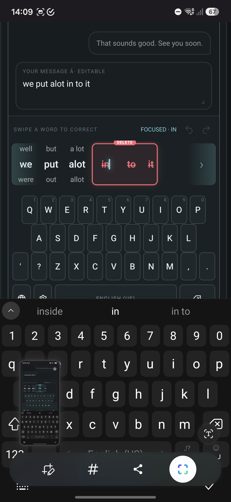
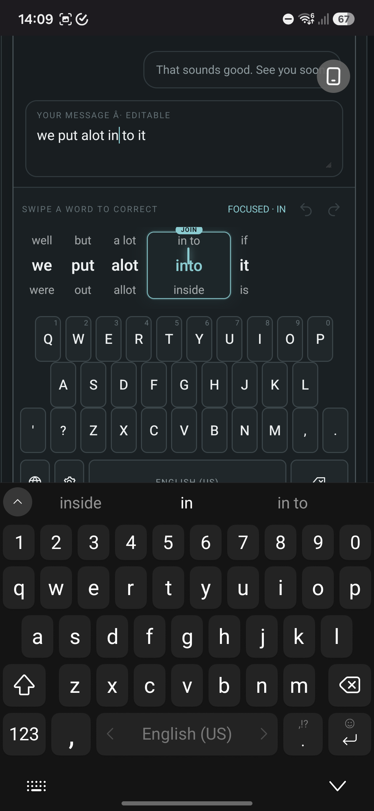
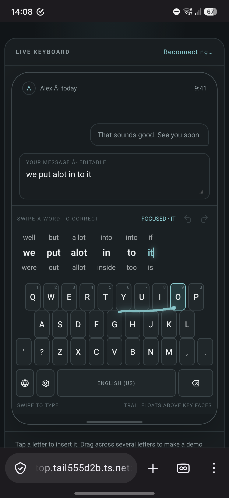

# Sentence-first keyboard: Jetpack Compose visual and motion design

Status: Draft for user review. This describes the native Compose target; it is not an implementation plan.

Behavior contract: [2026-09-20-reel-strip-behavior.md](2026-09-20-reel-strip-behavior.md)

Visual reference: [keyboard-reel-inline-v7.html](../prototypes/keyboard-reel-inline-v7.html)

## Screenshot references

These phone captures record the requested interaction states and complement the interactive V7 prototype. Use them as visual references during the native Compose comparison; the HTML prototype remains the source for live gesture behavior.

*Deletion preview: words are crossed out, their alternatives are hidden, and the strip can continue toward the sentence edge.*

*Join preview: “into” and its alternatives are centered inside the union of “in” and “to”.*

*Resting sentence strip and keyboard: the caret follows the editor selection, and the swipe trail stays readable over the key faces.*

## Goal and boundaries

Convert the approved sentence-first prototype into the actual Iaido Android IME, using Kotlin and Jetpack Compose. Match the quiet, premium graphite/silver/cyan direction while keeping the existing QWERTY and Hebrew key order and making the word strip, cursor, and gestures feel like one coherent input surface.

The HTML page includes a sample chat and editable message field to make the keyboard interaction understandable. Those are host-app mockups. The Android IME renders the keyboard surface only; the host editor remains owned by the application receiving text.

This design covers the visible keybed, swipe trail, inline sentence strip, word alternatives, split/join previews, cursor, deletion preview, edge scrolling, and undo/redo controls. Recognition ranking, language layout data, and InputConnection ownership remain with the existing Kotlin engine/service seams.

## Visual foundation

### Color tokens

Use the dark graphite prototype as the initial reference palette. These values are copied from V7 and should be represented as Compose `Color` tokens rather than repeated inline literals.

| Token | Prototype value | Use |
| --- | --- | --- |
| Page | `#111518` | Outer background around the keyboard |
| Panel | `#191E21` | Raised grouping surfaces, including the keyboard deck |
| Screen | `#171C1F` | Keyboard surface base |
| Deck | `#1A2023` | Keybed background |
| Key | `#20272A` | Flat key face |
| Key border | `#3B4549` | Fine key outline |
| Primary ink | `#EDF0F1` | Current word and key labels |
| Muted ink | `#8E9A9E` | Secondary labels and alternatives |
| Subtle ink | `#647176` | Section labels and disabled controls |
| Accent | `#8BCBD0` | Cursor, focused word, swipe path, active controls |
| Accent wash | `#263B3E` | Restrained active/pressed fill |
| Divider | `#30393D` | Surface boundaries |
| Delete | `#EB737B` | Deletion outline and struck-through words only |

Use a flat, precise surface: one-pixel-equivalent key outlines, restrained corner radii, and no raised key shadows. The accent should mark active input state, not decorate every key. The optional light palette in the prototype can follow the app theme later; the first comparison target is the dark palette above.

### Type and spacing

- Use the system sans family already used by the app. Keep letterforms clean and neutral.
- The committed sentence word is the visual anchor: prototype reference is 16 CSS px, medium weight, and about 30 CSS px line height.
- Alternatives are one size step smaller in the prototype (12 CSS px), with about 64% text opacity. Keep their contrast high enough to read at phone distance; do not dim them to the point of looking disabled.
- Keep strip section labels small and muted. They must not compete with sentence text.
- The word gap is the existing visible gap plus exactly 4 prototype CSS px. At the reference device density, map that measured difference to dp. Keep the additional touch target extension separate: each word target reaches halfway into the added gap, without moving or overlapping visible glyphs.
- Key-to-key spacing remains its own token and must not inherit the sentence word-spacing adjustment.
- Let sentence width grow naturally and scroll horizontally. A long alternative may widen its word lane after a commit, but its measured geometry stays fixed during an active gesture so pointer targets do not move under the finger.

## Compose surface map

The current seams are `KeyboardInputView.kt`, `SuggestionStrip.kt`, `KeyboardLayout.kt` / `KeyboardGeometry.kt`, and `IaidoInputMethodService.kt`. Keep the existing keyboard language/layout source and replace the strip's box-reel rendering with a sentence-first Compose surface.

| Visual element | Compose mapping | Layout and behavior notes |
| --- | --- | --- |
| Keyboard deck | `KeyboardSurface` in a `Column`/`Box` | Fills the IME view width. Uses the screen/deck tokens, stable insets and padding, and no animated height changes while typing. |
| Sentence strip header | `Row` with a small section label, focused-word label, undo and redo `IconButton`s | Keep icons visually small; provide a larger practical touch target around each. Undo and redo remain in fixed positions and independently expose enabled/disabled state. |
| Horizontal sentence viewport | `LazyRow` or one measured horizontally scrollable `Layout`, keyed by stable word span identity | Each item renders a current word and its above/below text. Preserve word order and slot geometry while dragging. No vertical boxes, cards, or edge-anchored replacement reel. |
| Word lane | `Box`/`Column` containing upper alternative, current word, and lower alternative | Center all three labels to the word lane. Use actual measured text widths and a fixed lane geometry for the pointer lifetime. Keep empty alternative rows visually empty but reserved so the selected baseline does not jump. |
| Current word | Compose `Text` with a cached `TextLayoutResult` | Brighter/larger than alternatives; active focus may take the cyan accent. Text layout supplies hit/caret mapping, including variable-width and RTL glyphs. |
| Upper/lower alternatives | Compose `Text` rows | Autocorrect results only. Do not use capitalization-only candidates. Keep distinct alternatives after merging recognizer and service data. |
| Strip caret | `Canvas` overlay positioned from the focused word's `TextLayoutResult` | A steady, narrow cyan caret maps to the authoritative InputConnection offset. Do not maintain a second independent caret state. |
| Join preview | A single overlay `Box`/`Canvas` on the strip layer | Compute the union from both source word bounds and the gap. Draw a fine cyan outline; center the joined word and its alternatives in the union. The overlay does not add a lazy-list item or change the underlying layout width. |
| Split preview | Preview text represented as two ordinary sentence words | Measure the complete preview sentence before drawing. The source span remains one edit transaction; on release, resulting words get independent stable lane identities. |
| Deletion preview | `Canvas` outline plus word text decorations | One red outline spans selected contiguous words; each selected word gets a strikethrough, and its alternatives are omitted for the preview duration. The editor is unchanged until release. |
| Edge-scroll affordance | `Box` aligned to viewport start/end with horizontal gradient and slim chevron `Icon` | No border and no red. Fade from transparent at the inner boundary toward at most 50% opacity at the outer edge. Keep the zone narrow and the chevron easy to notice without making it broad. |
| Keyboard rows | Existing key row data in Compose `Row`s and outlined `Box`/`Surface`s | Preserve QWERTY and Hebrew character positions and row offsets. Keep rendered key geometry identical to the geometry used by hit testing and swipe recognition. |
| Swipe trail | `Canvas` path overlay above keys | Draw over key faces while leaving key legends readable. Fade quickly after commit/cancel; the trail does not change key bounds. |
| Home/IME bottom inset | Existing IME-safe padding/navigation area | Keep the keyboard stable above system gesture/navigation insets and avoid placing gesture content beneath the system bar. |

For the strip, the preferred measurement model is a custom `Layout` (or an equivalent keyed row that exposes item coordinates) rather than a set of unrelated suggestion chips. It needs measured word bounds for caret placement, hit testing, join unions, deletion ranges, centering, and edge-scroll selection. Keep one geometry snapshot for the duration of a gesture; candidate text changes are previews and must not rebuild the pointer detector or move its target geometry.

## State and event ownership

Use a small immutable UI state model at the Compose boundary. The service/editor owns committed text, selection, suggestion sources, and history; Compose owns only transient gesture/animation state.

Suggested state responsibilities:

- `SentenceStripState`: ordered word spans, current/upper/lower candidate text, stable span IDs, authoritative selection offsets, scroll target, undo/redo availability, and optional preview.
- `StripPreview`: preview kind (`Alternative`, `Split`, `Join`, `Delete`, `Cursor`), source span(s), proposed output text, candidate slot, and any selected deletion range.
- `StripGestureState`: pointer ID, starting word/offset, start coordinates, initial scroll offset, frozen word/hit geometry, vertical direction, horizontal direction, edge penetration, and current mode.
- `StripAction`: semantic events such as preview candidate, update cursor, begin deletion, extend/shrink deletion range, commit edit, cancel preview, undo, redo, and change horizontal scroll.

The preview reducer must never call `InputConnection.commitText` or delete host text. Release dispatches one semantic action to the service/coordinator; only the service applies the edit and records history. Editor selection callbacks flow back into Compose and update the strip caret/focus. This avoids the strip and InputConnection becoming competing sources of truth.

The existing `SwipeTypingCoordinator` remains the candidate source for split/join commits where it owns the source span. Word corrections and deletion use the same atomic edit/history boundary. The task sequence and proposed service-to-Compose interface are recorded in the [implementation plan](../plans/2026-09-21-sentence-first-keyboard-compose.md).

## Gesture recognition and hit geometry

Use one stable pointer-input handler per strip surface with an explicit gesture-mode state machine. Do not key `pointerInput` on the changing candidate/preview state. A preview recomposition must not cancel the pointer stream or restart the gesture.

Gesture mode transition summary:

| Starting surface and movement | Mode | Result |
| --- | --- | --- |
| Strip whitespace/non-word area, horizontal movement | Horizontal scroll | Scroll the sentence, clamped at either end |
| Word, brief tap | Word tap | Set InputConnection cursor to the end of the word |
| Word, hold | Cursor placement | Set cursor from the initial touch's text-layout offset |
| Held word, horizontal movement | Cursor scrub | Update the editor selection at the character under the moving pointer |
| Word, vertical movement | Alternative preview | Show the resulting whole sentence and keep host text unchanged |
| Vertical preview, horizontal crossing into a neighboring word | Delete preview | Mark the source word; include another word only after crossing its midpoint |
| Delete preview, return over source word | Alternative preview | Clear deletion marks and restore the vertical candidate preview |
| Cursor/delete mode, pointer in edge zone | Edge scroll | Scroll continuously and update caret/deletion targets against the moving content |

Create a shared sentence-strip geometry snapshot from Compose-measured bounds. Derive visible text positions, word hit targets, midpoint thresholds, join unions, deletion outline, and cursor map from that same snapshot. The additional 4-pixel word gap contributes 2 pixels of hit extension per side. Avoid a second, approximate geometry calculation for gesture recognition.

For character placement, use the `TextLayoutResult` offset APIs and InputConnection's UTF-16 selection indices. Resolve a touch within a grapheme to its nearest legal insertion boundary. For RTL text, use the bidi-aware horizontal position returned by the layout result; do not reverse raw UTF-16 indices.

## Motion design

Keep movement crisp and restrained: short tweens, stable baselines, and no spring bounce. The times below are V7 reference values or initial native targets; screenshot and device iteration can tune them without changing gesture semantics.

| Motion | Initial duration/profile | Notes |
| --- | --- | --- |
| Key press fill/outline | 80 ms linear | Respond immediately; no key scale bounce. |
| Current/alternative color and opacity | 90-100 ms | Keep sentence geometry fixed while color changes. |
| Word swap/reel travel | 160-170 ms ease-out | Move the selected word into the current baseline and the displaced word to the chosen side. Commit text on release; motion is not a commit delay. |
| Join outline | 120 ms fade | Grow/fade to the union bounds without shifting neighboring word lanes. |
| Deletion outline/strikethrough | 100-120 ms | Track midpoint crossings promptly; do not lag the finger. |
| Edge-scroll zone and chevron | 110 ms fade | Fade in only for a qualifying held gesture; fade out on exit/cancel. |
| Focus scroll | One short 180-240 ms motion | Bring the focused word toward center when there is room; clamp at content edges. Interrupt cleanly if a newer cursor target arrives. |
| Swipe trail fade | About 210 ms after commit/cancel | Keep the path layered over keys until its opacity reaches zero. |
| History tooltip preview | Show after about 380 ms hold | Releasing the still-held control applies the shown action. A quick tap acts immediately. |

Compose implementation should use elapsed frame time for edge scrolling (`withFrameNanos` or an equivalent frame-clock loop), not delayed fixed-pixel steps. With normalized edge penetration `p` from 0 at the inner boundary to 1 at the outer boundary, use a smooth monotonic speed curve equivalent to the prototype's `24 + 780 * p^2` CSS pixels/second. Convert to dp using display density, clamp elapsed frame time after a pause, and clamp the resulting scroll to content bounds. While scrolling, keep the finger fixed in viewport coordinates and recompute word-midpoint/caret mapping from the shifted content each frame.

For reduced-motion settings, shorten or snap decorative transitions while preserving preview-before-release, caret synchronization, gesture thresholds, and edge-scroll behavior.

## Undo and redo controls

Place both outline icons in the strip header next to the focus label. Use an undo arrow and redo arrow with no text label in the resting state. The glyph should be about 15-16 dp; provide a larger transparent touch target without increasing the visible icon size.

Disabled undo and redo use the subtle text token at reduced opacity and do not open the preview. Enabled controls use muted ink at rest and cyan only while pressed/focused. A long press opens a small rounded panel anchored below the icon with an action title plus `NOW` and `AFTER` sentence rows. Keep it above the strip and outside the hit targets of words. Pointer cancellation or moving away dismisses it; releasing inside applies the pending history step.

History is a service-owned pair of stacks with multiple logical edits. A correction, split, join, or multi-word deletion is one transaction. Typing/backspace coalescing is based on an edit group boundary, and every entry stores text plus the selection needed to restore the caret. A new edit clears redo. The initial cap is 40 transactions, matching the prototype reference.

## Accessibility and test semantics

Expose stable Compose semantics on the real IME surface for:

- strip identity and committed/preview text state;
- each word lane's stable span identity, text, and source offsets;
- upper and lower alternative text and their source word;
- strip cursor offset;
- active join source range and preview word;
- active deletion range and whether each word is marked;
- undo/redo availability and long-press preview content;
- key labels and active language.

The connected-test driver introduced with this contract uses these semantic prefixes and fields:

| Node | Example description |
| --- | --- |
| Strip | `Iaido sentence strip` |
| Word text/bounds | `Iaido sentence word index=2; text=into; start=9; end=13; deleting=false` |
| Alternative | `Iaido sentence alternative word=2 side=above text=into` |
| Strip caret | `Iaido sentence cursor offset=13` |
| Whole-sentence preview | `Iaido sentence preview text=we put a lot into it` |
| Join union | `Iaido join preview text=into sourceStart=9 sourceEnd=14` |
| Deletion range | `Iaido deletion preview startWord=2 endWord=4` |
| Edge-scroll affordance | `Iaido edge zone direction=right` |
| Undo/redo | `Iaido undo`, `Iaido redo` (enabled state is semantic state) |
| History preview | `Iaido history preview` with action and before/after text |

Keep the alternative's text as the final description field so test code can locate an option by
its actual visible label without depending on candidate-list indexes. Dynamic sentence text belongs
in state descriptions where possible so the accessibility label stays concise.

Accessibility should announce a sentence word and its available alternatives without turning each glyph into a separate screen-reader stop. Touch character mapping remains based on actual measured text geometry. Use content descriptions/custom actions for correction context, and test tags/state descriptions for bounds and cursor assertions.

## Visual comparison acceptance

The reference is V7 at the same phone viewport and effective density as the emulator. Compare the native IME inside the real Settings preview, with the same sample sentence and state. Keep system bars/insets consistent; do not crop away sentence edges, strip caret, edge zones, undo controls, or keyboard rows.

Compare these settled and in-gesture states:

1. Resting English and Hebrew keyboard with the full sentence visible.
2. Upper and lower alternative preview, including the swapped-back state.
3. `alot` -> `a lot` split and `in to` -> `into` join from both source words.
4. Single-word and multi-word deletion preview, including pulling back to undelete.
5. Cursor placement and scrub, focus-centered scrolling, and both edge-scroll directions.
6. Disabled/enabled undo and redo, and a held preview tooltip.

Compare text baselines, word gap, caret offset, selected/alternative contrast, join union bounds, deletion outline, edge gradient/chevron, key outlines, key positions, and swipe trail layering. Screenshots supplement semantic geometry and editor-state assertions; pixel comparison alone is not sufficient.

## Review boundary

The implementation plan is [2026-09-21-sentence-first-keyboard-compose.md](../plans/2026-09-21-sentence-first-keyboard-compose.md). The behavior contract remains the source of interaction requirements; this document remains the visual, motion, and Compose mapping reference. No production keyboard behavior is implemented by these documents.
